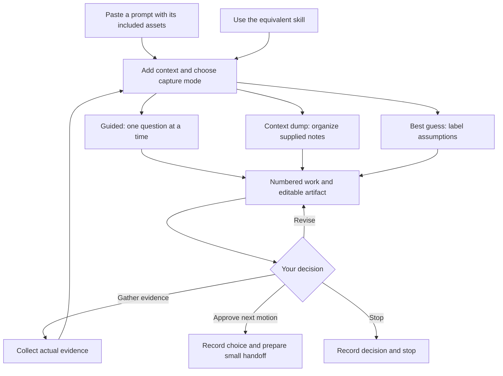

# Start with one discovery motion

For Product Managers, founders and product teams. Aim for a clearer decision and a next experiment, not a pile of completed canvases.

## Two ways into the same play



For workshop downloads and troubleshooting, use the [attendee guide](docs/ATTENDEE-GUIDE.md).

## Use a prompt, no installation

1. Choose a motion from the [launchpad](DEMO.md).
2. Download the prompt `.md` file using GitHub's **Download raw file** button and upload it to your assistant, or copy everything inside its large block into your AI chat. It includes the instructions, template and worked/weak examples.
3. Add direct notes or any useful earlier context and choose Guided, Context dump or Best guess. No previous skill run or formal handoff is required.
4. Edit the draft. Choose approve a bounded next motion, revise, gather evidence or stop.

For a first swing, try the [Persona prompt](prompts/03-persona.md). Append:

```text
Mode: Guided.
SYNTHETIC teaching exercise, not customer research.
Selected segment: mid-sized manufacturing plants.
Focal persona: maintenance manager deciding which equipment concern to investigate next.
Situation: equipment reports conflict before an investigation decision.
Desired outcome: clearer next-investigation choices.
Evidence: no actual interviews or plant observations supplied.
Help me develop a situational persona with jobs, pains, gains, stakes and current workarounds. Reuse this context; ask only the first missing question and wait.
```

## Use the equivalent skill

Install the `dlab` plugin for [Codex](docs/CODEX-PLUGIN.md) or [Claude Code](docs/PLUGIN.md) to get all ten skills with their templates and examples. Choose the matching client bundle; each guide links both `.plugin` and `.zip` downloads.

Open or attach the corresponding skill folder in an assistant with file access. Follow your tool's installer workflow if using installed skills; cloning does not install them automatically.

```text
Read skills/dlab-step03-persona/SKILL.md and follow it.
Use its template and examples when relevant.
Mode: Guided. Use the manufacturing teaching context above.
Stop at the human decision gate.
```

An installed tool may expose it as `$dlab-step03-persona`. Each skill is independently usable; no previous stages are mandatory when equivalent context is supplied.

## Hand off without hauling the entire conversation

```text
Target:
What we believe:
Evidence:
What is inferred:
Desired outcome:
Biggest unanswered question:
```

Carry source references and uncertainty labels. Add the selected segment, actual persona, opportunity and concept, 2x2 comparison, positioning statement, hypothesis and experiment rule, actual storyboard or full narrative when the next motion needs them. A title is not the artifact. Approving a tree does not select a branch.

At the gate, replace the bracketed choices with your actual decision:

```text
I choose [approve / revise / gather evidence / stop], because [reason].
Prepare a self-contained handoff for [next motion].
Preserve evidence labels, source references and the actual content that motion needs.
Use only what we produced; mark missing context UNKNOWN.
Record my decision. Do not start the next motion.
```

Paste that actual handoff after the next skill invocation or prompt. Approval permits another bounded step; it does not validate the idea.

## Get a local copy and verify it

The repository is public; downloading prompts does not require Git or a plugin.

```bash
git clone https://github.com/deanpeters/AI-Augmented-Product-Discovery-Lab.git
cd AI-Augmented-Product-Discovery-Lab
./scripts/test-library.sh
```

Copying prompts needs no local runtime. Maintainer checks need Python 3.9 or newer and Bash; they make no model calls. The separate optional Claude eval runner uses cloud calls through your existing authentication.
