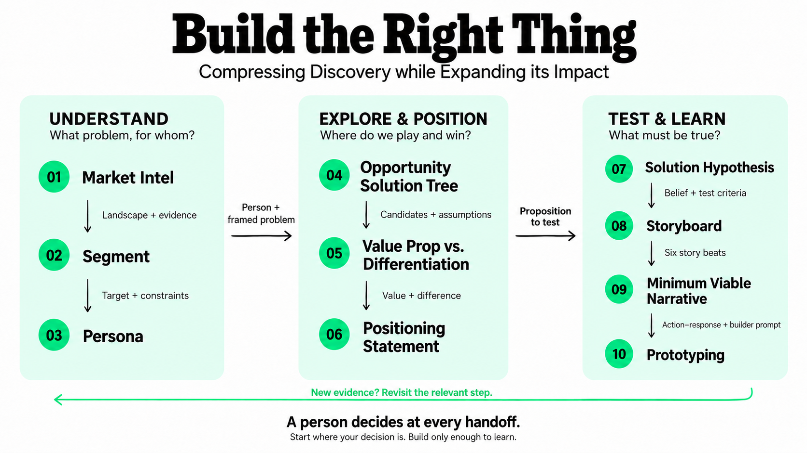

# AI-Augmented Product Discovery Lab

> **Build the right thing before burning runway on building it right.**

**10 discovery skills. 10 paste-ready prompt equivalents. Same play, two ways in.**

For Product Managers, founders and product teams deciding what deserves to be built. **Taking this home? Start with the [attendee guide](docs/ATTENDEE-GUIDE.md).** Use the [case-study kickoff messages](examples/kickoff-prompts.md) to launch an attached prompt or installed skill. Start with [QUICKSTART](QUICKSTART.md), choose a motion from the [demo launchpad](DEMO.md), or rehearse with the [Monday interaction script](examples/monday-demo-script.md).

Because AI can help you build the wrong thing really fucking fast.

## The discovery path



**A suggested learning path. Start where your decision is.**

For optional handoffs and return paths, see the [detailed flow in the attendee guide](docs/ATTENDEE-GUIDE.md#choose-your-starting-point). Its Mermaid diagram remains editable.

Market Intel → Segment → Persona → Opportunity Solution Tree → Value Prop vs. Differentiation 2x2 → Positioning Statement → Solution Hypothesis → Storyboard → Minimum Viable Narrative → Prototyping.

Start where the decision is. Each motion works independently, produces an editable artifact and stops for a human choice. This is a teaching path, not an automatic build pipeline. Evidence should increase before fidelity increases; a cheaper test can replace rendering or building.

Market Intel investigates the landscape. Segment reuses that intel, fills material source gaps and estimates population-led TAM, industry-filtered SAM and competition/capacity-constrained SOM before choosing a bounded context. Persona describes the person, situation, jobs, pains, gains and current workaround. Opportunities belong in the Opportunity Solution Tree. The 2x2 separates proposed customer value from meaningful differentiation. Positioning makes the proposition explicit, then Solution Hypothesis defines what could disconfirm it. Storyboard comes before Minimum Viable Narrative. Prototyping includes the experiment status and next evidence decision.

[Earn the customer's budget](docs/CUSTOMER-VALUE-AND-DIFFERENTIATION.md) explains the value test: removed friction → customer outcome → net economic payoff → purchase/renewal, with a separate reason to choose us and economics that let us serve them. OST, the 2x2 and positioning now carry that reasoning; AI capability and a high/high point are insufficient.

The value-versus-differentiation 2x2 is a solution bake-off: compare several OST candidates, competitor offerings and the current workaround for the same audience and outcome. OST output is optional. All skills accept direct notes or partial context, and can draft labeled assumptions without requiring an upstream artifact. See [the loosely coupled flow](docs/CHAIN.md).

[Productside canvas references](assets/productside/canvases/README.md) are included with Dean's confirmed permission to share. Skills and prompts preserve their useful fields and add evidence labels; the visual files are optional.

## Use a skill or a prompt

Install all ten skills as the `dlab` plugin: [Codex setup and downloads](docs/CODEX-PLUGIN.md) or [Claude setup and downloads](docs/PLUGIN.md). Both kits provide `.plugin` and `.zip` archives in `dist/`; prompts remain usable without installation.

Every skill has Guided, Context dump and Best guess entry modes. Guided capture reuses context and asks one question at a time, with up to five numbered questions and two clarifications. The visible work ends with a named artifact, evidence labels, a small handoff and a human gate.

Every skill folder bundles:

- `SKILL.md`: scoped instructions and rich metadata.
- `template.md`: the motion's editable artifact structure.
- `examples/worked-example.md`: a filled synthetic example with evidence limits.
- `examples/weak-example.md`: a specific failure and its repair.

The prompt equivalent embeds all four resources. Attendees can copy its single large block into a normal AI chat without installing a skill or giving it repository access. See the [skill contract](docs/SKILL-SPEC.md) for packaging details.

| Step | Motion | Skill | Paste-ready prompt | Output |
|---|---|---|---|---|
| 01 | Market Intel | [Skill](skills/dlab-step01-market-intel/SKILL.md) | [Prompt](prompts/01-market-intel.md) | Market Intelligence Brief |
| 02 | Segment | [Skill](skills/dlab-step02-segment/SKILL.md) | [Prompt](prompts/02-segment.md) | Segment Selection Brief |
| 03 | Persona | [Skill](skills/dlab-step03-persona/SKILL.md) | [Prompt](prompts/03-persona.md) | Situational Persona |
| 04 | Opportunity Solution Tree | [Skill](skills/dlab-step04-opportunity-solution-tree/SKILL.md) | [Prompt](prompts/04-opportunity-solution-tree.md) | Opportunity Solution Tree |
| 05 | Value Prop vs. Differentiation 2x2 | [Skill](skills/dlab-step05-value-prop-differentiation/SKILL.md) | [Prompt](prompts/05-value-prop-differentiation.md) | Value Prop vs. Differentiation 2x2 |
| 06 | Positioning Statement | [Skill](skills/dlab-step06-positioning-statement/SKILL.md) | [Prompt](prompts/06-positioning-statement.md) | Positioning Statement |
| 07 | Solution Hypothesis | [Skill](skills/dlab-step07-solution-hypothesis/SKILL.md) | [Prompt](prompts/07-solution-hypothesis.md) | Solution Hypothesis |
| 08 | Storyboard | [Skill](skills/dlab-step08-storyboard/SKILL.md) | [Prompt](prompts/08-storyboard.md) | Storyboard |
| 09 | Minimum Viable Narrative | [Skill](skills/dlab-step09-minimum-viable-narrative/SKILL.md) | [Prompt](prompts/09-minimum-viable-narrative.md) | Minimum Viable Narrative |
| 10 | Prototyping | [Skill](skills/dlab-step10-prototyping/SKILL.md) | [Prompt](prompts/10-prototyping.md) | Prototype Experiment Brief |

Every completed motion ends with a concise, canvas-ready readout: the actual result, material evidence limit and next decision. Storyboard preserves six frames; MVN preserves every internal action–response transaction. Supporting evidence remains traceable without repeating the full report.

Segment ends with a boss-ready commercial readout: estimated TAM/SAM/SOM populations, potential dollars and the reasoning behind them. Price hypotheses stay labeled; SOM annual revenue potential is distinguished from earned revenue, customer savings and profit.

## Evidence and decisions

**Outcomes > outputs. Context is work. Simulation generates hypotheses, not customer truth.**

Label sourced observations ACTUAL DATA, interpretation INFERRED, provisional beliefs ESTIMATE / BEST GUESS, and missing evidence UNKNOWN. Retain direct URLs, dates, conflicting evidence and source limitations. Never invent a number because a table looks incomplete without one.

Synthetic personas, scenarios, stories and prototype data are thinking aids. A generated canvas, attractive storyboard or working prototype does not establish customer demand or operational benefit.

At each gate, choose approve a bounded next motion, revise, gather evidence or stop. A recommendation is not approval. Carry only the actual small handoff plus whatever the next motion needs. See [chain behavior](docs/CHAIN.md).

## Monday's performance

**AI-Augmented Product Discovery & Ideation Validation with Dean Peters**

Monday, October 5, 2026, 6:00 PM–8:00 PM EDT. Hosted by the Triangle Startup Collective at Raleigh Founded, 509 W North St, Suite 224, Raleigh, NC. With gratitude to Parker Mayes and James Fredley.

The rhythm is brief framing → live work → audience reaction → synthesis → next question. The [SHOWRUN](SHOWRUN.md) controls the performance; the [demo script](examples/monday-demo-script.md) supplies copy-ready interactions, transitions and recovery lines. Use actual rehearsal outputs as receipts. Current fallback seeds are explicitly synthetic illustrations.

## Keep the skills honest

After changing a skill or its templates/examples, run `bash scripts/refresh-library.sh` to update prompts and both distribution kits together. See [the maintenance checklist](docs/MAINTAINING.md). GitHub's validation check detects stale prompts and archives.

Run local metadata, asset, prompt-parity, link, case-reference and regression checks:

```bash
./scripts/test-library.sh
```

These checks make no model calls. The [use-case guide](evals/README.md) also supports optional behavioral testing through Claude; that uses cloud inference and your configured allowance or API budget.

The corrected ten-motion chain has **not** been behaviorally re-run. Prior eleven-motion results are historical and do not validate this revision. See [results](evals/RESULTS.md) and [readiness](docs/READINESS.md). A full live rehearsal is still required.

Share the [repository and Mural QR codes](assets/qr/README.md) during the workshop; keep their white margins intact.

## Repository and reuse

The repository is public; the current attendee distribution is v0.1.5. No autonomous discovery operator is implemented. There is no agent-strategy canvas in the demo or chain.

```text
skills/       10 skills with templates and worked/weak examples
prompts/      10 generated, self-contained prompt equivalents
examples/     manufacturing seed and full presenter script
fallbacks/    explicitly synthetic illustration links
reference/    guided capture and handoff conventions
evals/        runnable synthetic cases and verification record
scripts/      local validation, prompt export and optional eval runner
docs/         catalog, skill contract, chain, provenance and readiness
```

Original lab materials are licensed under [CC BY-NC-SA 4.0](LICENSE). Commercial use requires express written permission from Dean Peters. Productside canvases, logos and brand assets used here are Productside property, included with permission, and are not covered by that license. See [provenance](docs/PROVENANCE.md).
