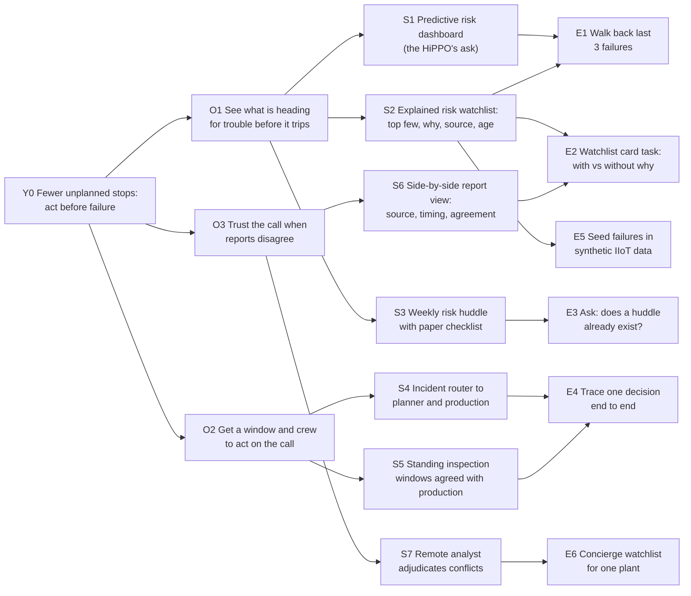

# 04 Opportunity Solution Tree

Lab adaptation, not an authoritative Productside canvas.

- **Date:** 2026-10-04
- **Motion / mode:** Opportunity Solution Tree / Context dump
- **Built from:** 03 Persona handoff; case file part 2 §6 (opportunities O1 to O4 and experiments)
- **Status:** DRAFT. All tests NOT RUN.
- **Decider:** Claude, as stand-in for Dean. **Not a recorded human approval.**
- **Synthetic status:** SYNTHETIC. Every opportunity is a hypothesis about a persona we have not interviewed.

## Request, persona and outcome

- **Incoming request:** "Build an AI-enhanced maintenance dashboard." Kept as candidate S1, not the root.
- **Persona:** maintenance manager, mid-sized discrete plant, buried in early warnings, reacting to whatever trips first.
- **Outcome (Y0):** fewer unplanned stops because more checks happen before failure, in planned windows. Intervention by prediction instead of by exception. Metric: share of corrective work that was unplanned. Baseline and target UNKNOWN.

The dashboard is an output. The outcome is the shift from reacting to interruptions to acting on prediction.

## The tree



Legend: every O, S and E is a hypothesis. E = test, NOT RUN.

```text
Y0 Fewer unplanned stops: act before failure
├── O1 See what is heading for trouble before it trips
│   ├── S1 Predictive risk dashboard (the HiPPO's ask)
│   │   └── E1 Walk back the last 3 failures
│   ├── S2 Explained risk watchlist: top few, why, source, age
│   │   ├── E1 (shared)
│   │   ├── E2 Watchlist card task, with vs without the why
│   │   └── E5 Seed failures in synthetic IIoT data
│   └── S3 Weekly risk huddle with paper checklist (non-AI)
│       └── E3 Ask whether a huddle already exists and what it misses
├── O2 Get a window and crew to act on the call
│   ├── S4 Incident router to planner and production
│   │   └── E4 Trace one recent decision end to end
│   └── S5 Standing inspection windows agreed with production (process)
│       └── E4 (shared)
└── O3 Trust the call when reports disagree
    ├── S6 Side-by-side report view: source, timing, agreement
    │   └── E2 (shared)
    └── S7 Remote analyst adjudicates conflicts (service)
        └── E6 Concierge watchlist for one plant, by hand
```

## Register

| ID | Parent | Description | Label / basis |
|---|---|---|---|
| Y0 | | Fewer unplanned stops; more checks before failure | ESTIMATE; baseline UNKNOWN |
| O1 | Y0 | Early signals exist but are buried, so the plant reacts to exceptions | ESTIMATE; alert-overload framing is vendor-sourced |
| O2 | Y0 | Even a good call waits on permission, parts and a window | INFERRED from small studies and UpKeep 2026 (31% name production scheduling) |
| O3 | Y0 | Reports conflict and the manager cannot tell which to trust | ESTIMATE; closest support Golightly 2018 (13 interviews) |
| S1 | O1 | Dashboard of all assets with trends and alerts | Stakeholder request |
| S2 | O1 | Ranked short list of at-risk equipment with the reasons, source and age | Proposed, provisional |
| S3 | O1 | Non-AI process alternative | Proposed |
| S4 | O2 | Route a flagged check to planner and production for a window | Deck candidate "incident router" |
| S5 | O2 | Process alternative | Proposed |
| S6 | O3 | Case file S1 report-comparison view | Case file part 2 §6 |
| S7 | O3 | Service, not software | Case file part 2 §6 (S5 there) |

## Test cards (all NOT RUN; thresholds proposed)

| Test | Covers | Riskiest assumption | Smallest test | Signal | Disconfirmation |
|---|---|---|---|---|---|
| E1 | S1, S2 | Early signals were present before recent failures | With 5 to 8 managers, walk back their last 3 unplanned stops | Signals existed in 2 of 3 cases and nobody ranked them | Signals absent, or seen and ignored for lack of a window (route to O2) |
| E2 | S2, S6 | Seeing the why and the source changes the pick | Paper cards of 6 flagged assets, with and without reasons; ask for the next check and the explanation | Picks or explanations change with the reasons shown | Same picks either way |
| E3 | S3 | No process already does this | One interview question | No regular risk review exists | A working huddle already ranks risk |
| E4 | S4, S5 | Permission and scheduling are not the bottleneck | Trace one recent decision from first signal to fix | Most delay before anyone knew | Most delay waiting on window, parts or approval |
| E5 | S2 | A ranking can be explained in a sentence | Seed known failure patterns in synthetic IIoT data; check the top 3 and the explanation | Seeded faults surface with a readable why | Explanations are noise. Hypothesis-generating only, never validation |
| E6 | S7 | A human can produce a useful watchlist from the plant's own data | Analyst builds the watchlist by hand for one plant for two weeks | Manager acts on it | Manager ignores it |

## Customer-payoff bridge

| Branch | Removed friction / new action | Economic lever | Realization condition | Proof gap |
|---|---|---|---|---|
| O1 | Stop scanning everything; act on the top few before they trip | Avoided unplanned downtime hours; less overtime | Manager acts, and gets a window | Downtime cost per hour UNKNOWN; prediction accuracy UNKNOWN |
| O2 | Stop negotiating each window from scratch | Faster time to fix; more planned work | Production agrees | Who approves, and how long it takes, UNKNOWN |
| O3 | Stop guessing which report to believe | Fewer wasted dispatches of scarce techs | Reasons are trusted | Whether trust follows visibility UNKNOWN |

Budget owner for any of these: likely plant manager or ops director. UNKNOWN. Delivery cost risk for S2 and S7: human review of ambiguous flags (Samotics does this to hold false alerts down, vendor claim).

## Branch comparison and portfolio

| Branch | Expected contribution to Y0 | Evidence strength | Test cost and access | Read |
|---|---|---|---|---|
| O1 | Highest if signals exist and get acted on: this is the prediction-instead-of-exception shift | Weak; vendor framing | Cheap (E1, E2); needs willing managers | Lead branch |
| O2 | High if permission dominates | Small studies lean this way | Cheap (E4) | The hedge; the case file's lean |
| O3 | Supporting; trust is how O1 pays off | Thin | Cheap (E2 shared) | Fold into O1 as the "why" |

**Recommended portfolio for the 2x2 bake-off:** S1 (the dashboard, so the HiPPO's ask gets a fair hearing), S2 (explained watchlist, with S6's source and timing folded in), S4 (incident router, the coordination hedge). Compare them against the status quo and the incumbents.

**Strongest counterargument:** the case file's lean is that organization, not information, is the bigger blocker. If E1 and E4 say "we knew, we couldn't get the window," O2 leads and prediction is a nice-to-have.

**What would change the focus:** E1 showing no early signal before recent failures kills O1 for this segment.

## Decision record

- **Draft choice (stand-in):** take S1, S2 and S4 into the bake-off. First discriminating tests: E1 and E4, run together in the same interviews.
- **Decider:** Claude as stand-in. Dean's selection: not recorded.

## Handoff

```text
Target: Maintenance manager, mid-sized discrete plant.
What we believe: The shift that matters is from intervention by exception to intervention by prediction. O1 leads, O2 is the hedge.
Evidence: None from customers. Vendor framing on alert overload; small studies on scheduling and trust.
What is inferred: The dashboard (S1) is one candidate. An explained watchlist (S2) may deliver the same shift with less noise. An incident router (S4) attacks the window problem.
Desired outcome: Fewer unplanned stops; more checks in planned windows.
Biggest unanswered question: When a failure hit, were the signals there and ignored, or there and blocked?
```

## Final readout

The outcome is fewer unplanned stops because maintenance managers act on prediction instead of reacting to exceptions (Y0). Three needs hang off it: see what is heading for trouble before it trips (O1), get a window and crew to act (O2), and trust the call when reports disagree (O3). O1 leads because it is the shift from interruption to prediction, and its payoff is avoided downtime hours, likely paid for by the plant or ops leader (budget owner UNKNOWN). Send three candidates to the bake-off: the HiPPO's dashboard (S1), an explained risk watchlist (S2) and an incident router (S4). Biggest gap: whether signals were present and ignored, or present and blocked by production. E1 and E4 answer that in the same interviews. Next decision: approve the bake-off for S1, S2 and S4 (Recommended). Evidence caveat: no opportunity here has been observed. Human choice: not recorded.
