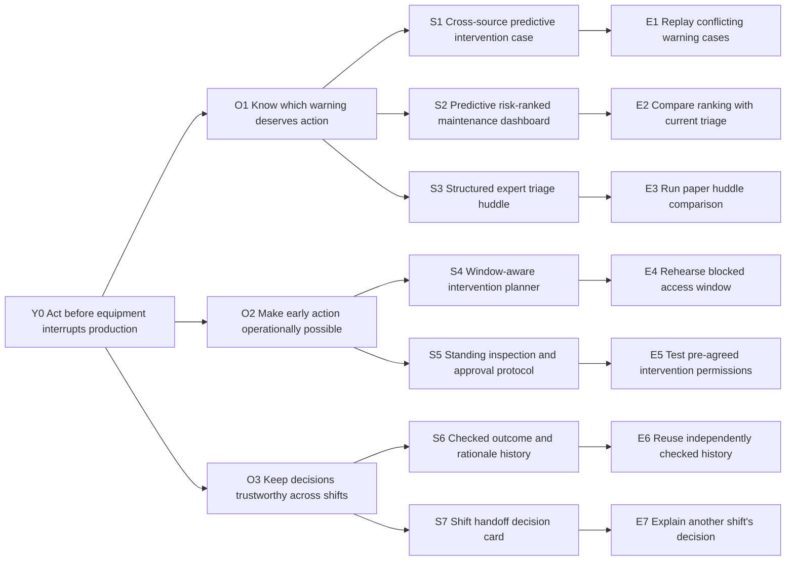

# Opportunity Solution Tree

Date: October 4, 2026. Skill: `dlab-step04-opportunity-solution-tree` 0.4.0, Best guess. Built from: [Persona](03-persona.md), L1/L3, R2/R3. Status: DRAFT. Every opportunity/solution is a hypothesis; tests NOT RUN. Codex provisional portfolio; human selection not recorded.

Incoming HiPPO request: **“Build an AI-enhanced maintenance dashboard for managers at mid-sized manufacturers.”** Preserve it as S2, not the outcome root.

Persona: Jordan. Y0 desired outcome: intervene on developing equipment risk before interruption. Observe actionable warnings converted into timely verified/planned interventions; actual baseline and target UNKNOWN. Do not use dashboard adoption as the outcome.

## Branching tree

Legend: Y = desired outcome; O = hypothesized need; S = provisional mechanism; E = unrun experiment. All nodes connect to Y0. No branch is validated.



```text
Y0 Act before equipment interrupts production
├── O1 Know which warning deserves action
│   ├── S1 Cross-source predictive intervention case → E1 Replay conflicting warning cases
│   ├── S2 Predictive risk-ranked dashboard → E2 Compare ranking with current triage
│   └── S3 Structured expert triage huddle → E3 Run paper huddle comparison
├── O2 Make early action operationally possible
│   ├── S4 Window-aware intervention planner → E4 Rehearse blocked access window
│   └── S5 Standing inspection/approval protocol → E5 Test pre-agreed permissions
└── O3 Keep decisions trustworthy across shifts
    ├── S6 Checked outcome/rationale history → E6 Reuse checked history
    └── S7 Shift handoff decision card → E7 Explain another shift's decision
```

## Supporting register and candidate distinctions

| ID / parent | Mechanism and basis | Tradeoff |
|---|---|---|
| O1 / Y0 | Evidence quality and interpretation; F1 + R2/R3, INFERRED relevance | Could be easy already; frequency UNKNOWN. |
| S1 / O1 | Compare source age, trend, contradictions and consequence; suggest a verification/action with rationale. ESTIMATE / BEST GUESS. | Data mapping and expert judgment may cost too much. |
| S2 / O1 | HiPPO dashboard ranks emerging asset risks and shows trends. ESTIMATE / BEST GUESS. | Prediction/ranking overlap with incumbent offerings; may create another alert queue. |
| S3 / O1 | Manager and technician use a paper evidence checklist to triage developing risks. ESTIMATE / BEST GUESS. | Cheap and familiar; requires scarce expert time. |
| O2 / Y0 | Acting requires permission and capacity; R2/R3, INFERRED target relevance | May dominate O1. |
| S4 / O2 | Connect a provisional risk horizon to available production/access windows. ESTIMATE / BEST GUESS. | Cannot invent forecast accuracy or grant authority. |
| S5 / O2 | Pre-agree who can arrange a verification and when to escalate. Process alternative. | Requires organisational buy-in; no novel prediction. |
| O3 / Y0 | Preserve reasoning and avoid stale reassurance. F1 + R2, INFERRED. | History can propagate errors. |
| S6 / O3 | Record actual inspection findings and checked corrections for later review. ESTIMATE / BEST GUESS. | Useful labels/data rights and independent checks UNKNOWN. |
| S7 / O3 | A short shift handoff retains evidence, owner and revisit trigger. Non-AI alternative. | Existing CMMS can plausibly hold it already. |

## Test cards

All criteria below are proposed, not observations. Two-session paper comparisons can precede software. Participant access not arranged; use authorised/deidentified records for any actual field work.

| Test | Candidates | Risk / smallest test | Observable signal | Disconfirmation |
|---|---|---|---|---|
| E1 | S1 | Manager replays two conflicting-warning cases with an intervention case | Justifies next verification, spots missing evidence, changes action appropriately | Blindly follows a rank or needs expert reconstruction every time |
| E2 | S2 | Same cases with dashboard ranking only | Identifies developing risk with a usable next step | Rank increases certainty without a defensible action |
| E3 | S3 | Same cases with a structured paper huddle | Equal-quality decision at lower total effort | Time/access to expert defeats use |
| E4 | S4 | Remove the preferred window during a replay | Replans or escalates without assuming permission | A good prediction remains unactable |
| E5 | S5 | Rehearse an agreed approval protocol with planner/production | Authority and access become concrete | Real constraints cannot be pre-agreed |
| E6 | S6 | Show a prior corrected case, then a new case | Uses comparable verified findings while rejecting inapplicable history | Old case produces inappropriate confidence |
| E7 | S7 | Another shift reconstructs decision from a one-page card | Names evidence, uncertainty, owner and revisit trigger | Still needs the original decision-maker |

Suggested test appetite: short task replays during a proposed 10-business-day discovery sprint, not a staffed operational trial. Cash cost UNKNOWN; staff/participant time still costs effort.

## Customer-payoff bridge and branch comparison

| Branch | Friction removed → customer outcome → economic lever | Realisation condition / evidence gap | Budget/adoption/delivery hypothesis |
|---|---|---|---|
| O1 | Less guesswork → justified early verification → fewer false dispatches or recoverable production losses | An accurate-enough signal actually precedes a preventable event | Plant maintenance-improvement budget; mapping/expert support cost risk |
| O2 | Less approval friction → action while a window exists → lower disruption/intervention cost | Staff, parts and permission available; window fits real asset condition | Production + maintenance commitment; process may beat software |
| O3 | Less repeated reconstruction → better subsequent decisions → useful capacity and lower rework | History is checked and comparable; time is redeployed | Existing CMMS is strong substitute; labeling/support burden |

Recommended portfolio for bake-off: **S1, S2, S3, S4** plus S5 as the organisational counter-test. S6/S7 support later continuity, not an excuse to build seven features. Strongest counterargument: accurate vendor insight plus a planner's existing process may already solve the job. R4/R5 explicitly threaten the “our AI knows better” story.

## Final readout

For Jordan, progress means a verified or planned intervention before developing risk becomes an interruption. Compare **S1 cross-source intervention case**, **S2 HiPPO predictive dashboard**, **S3 paper expert huddle** and **S4 window-aware planner**. They attack different gaps: credible evidence, visibility, expert interpretation and ability to act. Customer payoff could be protected recoverable contribution and fewer unnecessary interventions, but neither is measured. R2/R3 make coordination a serious competing explanation; S5's permission protocol can expose it cheaply. **Recommended:** take this portfolio into the common-baseline 2x2 and examine whether software earns incremental budget. Every branch is provisional, tests NOT RUN, human product choice not recorded. Codex proceeds under the rehearsal instruction.
