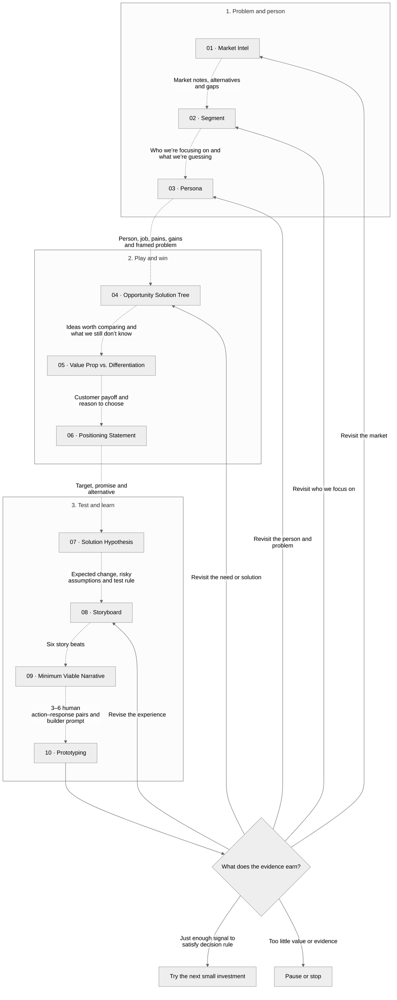

# Take the discovery lab with you

Use this kit to explore what deserves investment before committing to a build. You get ten skills, ten equivalent prompts, editable templates, examples and optional Productside canvas references. Start with one decision; you do not have to run the whole chain.

## Choose your starting point



**A suggested learning path. Start where your decision is.**

The three phases ask: What problem are we solving, and for whom? Where do we play, where do we win? What must be true, how do we learn?

Start wherever you need help. Bring what you have. Dashed arrows show useful context you can carry forward, not required handoffs. Each motion ends with your choice: continue, revise, find evidence or stop.

Before testing, decide what would make you continue, change direction or stop. The final diamond is the decision inside Prototyping, not an eleventh motion. Meeting a test rule earns only the next small investment that rule covers. Enough to try something isn’t the same as enough to fund it.

<details>
<summary>Edit the flow in Mermaid</summary>



</details>

## The easiest route: upload a prompt

1. Open the [demo launchpad](../DEMO.md) and choose a motion.
2. Open its prompt file and use GitHub's **Download raw file** button. Upload that `.md` file to your AI assistant. Alternatively, paste everything inside the prompt's large code block into your chat.
3. Paste the matching context kickoff from the [demo companion](../examples/kickoff-prompts.md). Each command has its own copy-ready block. Replace the teaching context with your situation when ready.
4. Review the result, its evidence limits and final readout. Choose revise, gather evidence, a bounded next motion or stop. No automatic build follows.

For example, upload `prompts/05-value-prop-differentiation.md`, then paste:

```text
For maintenance managers at mid-sized manufacturing plants, run this attached prompt in context dump mode.
SYNTHETIC teaching exercise; no observed plant or customer evidence.
Outcome: reduce avoidable unplanned downtime through justified intervention before failure.
Compare predictive signal context, shift intervention huddles and an evidence checklist.
Current alternative: reactive log review and technician discussion.
Explain what's in it for the customer, who might fund it, what makes choosing us rational,
and what evidence is missing about customer net benefit and our delivery economics.
No price, willingness-to-pay evidence or measured savings supplied; keep assumptions explicit.
Finish with a concise commercial readout and stop at my decision. Do not build.
```

The prompt includes the skill instructions, template and worked/weak examples. You do not need Git, Terminal, Python or a plugin. File-upload support depends on your assistant; pasting is the fallback.

## Prefer installed skills?

Use the guide for your client:

| Client | Setup | Current v0.1.8 download |
|---|---|---|
| Claude | [Claude setup](PLUGIN.md) | [ZIP](https://raw.githubusercontent.com/deanpeters/AI-Augmented-Product-Discovery-Lab/main/dist/dlab-claude-0.1.8.zip) / [.plugin](https://raw.githubusercontent.com/deanpeters/AI-Augmented-Product-Discovery-Lab/main/dist/dlab-claude-0.1.8.plugin) |
| Codex | [Codex setup](CODEX-PLUGIN.md) | [ZIP](https://raw.githubusercontent.com/deanpeters/AI-Augmented-Product-Discovery-Lab/main/dist/dlab-codex-0.1.8.zip) / [.plugin](https://raw.githubusercontent.com/deanpeters/AI-Augmented-Product-Discovery-Lab/main/dist/dlab-codex-0.1.8.plugin) |

Both kits contain the same canonical skills, prompts, examples and customer-value guidance, with client-specific packaging. Within each client, `.zip` and `.plugin` contain identical bytes. Keep the ZIP intact for upload where supported. Codex's documented marketplace install uses the repository, not an archive upload. Follow your client's guide; an extension alone does not make a kit installable in every assistant.

If an installed skill still gives an old result, confirm you have **v0.1.8** and start a new session after updating through your client's plugin manager. OST, the 2x2 and Positioning should show skill version **0.4.2**. Uploading the current prompt is a quick fallback that bypasses an old installed skill. Do not delete your client configuration to troubleshoot a cache.

## What to expect at the end

- Segment: a commercial TL;DR and TAM/SAM/SOM population / potential economics / reasoning table.
- OST: an actual branching Mermaid tree and equivalent plain-text fallback, followed by a short recommendation.
- The 2x2 and positioning: customer payoff, budget/switching/renewal reasoning, rival-relative proof gaps and separate provider economics. See [Earn the customer's budget](CUSTOMER-VALUE-AND-DIFFERENTIATION.md).
- Storyboard: six story beats. Minimum Viable Narrative: all 3–6 internal human-action/system-response transactions and a portable prototype prompt.
- Every motion: evidence labels, material uncertainty and your next decision.

Mermaid may display as text in some assistants; the OST includes a readable plain-text tree. Simulations and fictional examples generate hypotheses, not customer truth. A compelling demo does not establish demand, measured savings or a moat.

## Bring your own problem

1. Name a decision you need to make. Choose the motion that helps with that decision.
2. Bring what you have: notes, research, an existing product, a stakeholder request or a labeled best guess.
3. Run the skill or upload its prompt. Context dump mode is a good start when you already have notes.
4. Critique the readout. What is supported? What is guessed? What is still UNKNOWN? What would make the recommendation wrong?
5. Choose the smallest useful next test. Write down what result would make you continue, change direction or stop before running it.

**Did uncertainty decrease?** Can you name something you now know, an assumption you exposed or a possibility you ruled out? Can you explain what evidence changed your thinking? If all you have is a nicer artifact, choose a test that could change your decision.

For three short routes, see [the chain guide](CHAIN.md): starting from scratch, improving an existing product and exploring a stakeholder’s solution request.

## What synthetic learning can tell you

| Thinking aid | Useful for | Cannot establish | Real evidence needed next |
|---|---|---|---|
| Simulated equipment failures | Missing signals, timing conflicts and scenarios worth testing | Real prediction accuracy, avoided downtime or savings | Plant failure histories, measured signals and prospective tests under real operating conditions |
| Synthetic persona | Possible jobs, pains, gains and interview questions | Actual customer behavior, prevalence or demand | Recent-decision interviews and observation of relevant people doing the work |
| Invented quote | Trying possible language, clearly labeled synthetic | What a customer said or willingness to pay | Recorded customer language and actual buying decisions |
| Fictional prototype task | Checking whether the experience hangs together | Adoption, margin improvement or production readiness | Real participant tasks, adoption effort, costs and results over time |

These aren't customers. They're hypothesis-generating machines. A simulation that behaves nicely is a reason to investigate, not permission to claim customer success.

## Continue learning

Use the [case-study kickoff companion](../examples/kickoff-prompts.md), [chain guide](CHAIN.md) and [customer-value guide](CUSTOMER-VALUE-AND-DIFFERENTIATION.md). The [use cases](../evals/README.md) support independent testing. Local maintainer checks pass; the revised behavioral cases and full live rehearsal remain unrun. See [readiness](READINESS.md) and [verification results](../evals/RESULTS.md) for the exact limits.

Downloading/building the kit makes no model calls. Running a skill or prompt in a hosted assistant uses that assistant's normal allowance. The optional Claude behavioral runner consumes cloud inference; it is separate from local checks.

Original lab materials use [CC BY-NC-SA 4.0](../LICENSE). Productside canvases and brand assets are included with Dean's confirmed sharing permission and retain their separate ownership; see [provenance](PROVENANCE.md).

## Follow the receipts

Read [How we search](SEARCHING-PHILOSOPHY.md) for the source routes and investigator hats. Steps 1 and 2 research when browsing is available, reuse supplied evidence and put clickable citations beside factual claims and sizing inputs. Context dump and Best guess retain this research duty. With no source access, the output is explicitly provisional. Current Market Intel skill: v0.3.0; Segment: v0.5.0.
