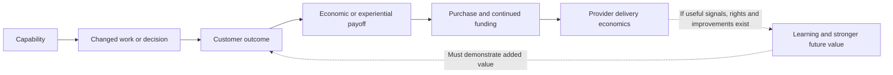

# Earn the customer's budget

A product should answer: **what gets better enough that the customer will buy, keep buying and choose us over an alternative?** Then ask whether serving that customer leaves enough economic value for us to keep investing.

This lab guidance adapts Dean Peters' supplied *Thoughts on AI Value Proposition and Differentiation* (October 4, 2026). It is a reasoning framework, not market research or proof that any proposed AI product has these advantages. The skills and self-contained prompts embed the necessary instructions; attendees do not have to upload this document.

## Follow the payoff all the way through

“Predicts failures” stops at a capability. “Gives the maintenance manager an explainable opportunity to intervene early” connects it to work. “Avoids recoverable lost production after intervention costs” connects it to economic value. None is established simply because a simulation runs or a manager likes the display.

| Question | A useful answer contains | Weak substitute |
|---|---|---|
| What's in it for me? | Painful work removed or useful action made possible; observable outcome | Faster summaries, more alerts, better AI |
| Where is the delight? | A specific moment of relief, agency or newly possible progress in the workflow | Attractive UI or an invented testimonial |
| What moves economically? | Revenue/contribution, margin, spend, time/capacity, risk or newly affordable activity, with a realization mechanism | Saved hours automatically treated as cash |
| Why move budget? | User/beneficiary/payer, current spend or proposed new investment, trigger, approval hurdle and switching burden | “Customers will pay because it is useful” |
| Why buy ours? | Relevant difference against a specific closest alternative; evidence or gap | Beating the status quo while ignoring a rival |
| Why keep paying? | Repeated net benefit, useful accumulated context and observable renewal evidence | Usage, accepted alerts or lock-in alone |
| Can we afford it? | Delivery costs, onboarding, acquisition and fixed-cost limits, separately modeled | High price or customer savings presented as our profit |

## Do the economics without faking certainty

Use a consistent customer unit, currency and time basis. Source real inputs where available. Keep each assumption labeled; use symbolic formulas if inputs lack a numerical basis. Clearly illustrative what-ifs can help decide what needs measuring, but never become measured savings or validated pricing.

**Customer net value** = realized incremental outcome value − product fee − additional operating/intervention cost − adoption cost for the relevant period.

**Provider recurring delivery contribution** = product revenue − inference/hosting − human review/support − other recurring delivery costs.

Then account separately for onboarding and acquisition/fixed costs. Delivery contribution is not total profit. SOM revenue potential is not customer benefit, profit, a contract or willingness to pay.

For maintenance, begin with potentially avoided lost hours × contribution per recoverable hour × realization fraction. Confirm whether demand, timing, capacity and adoption permit that contribution to be realized. Do not add revenue protected, margin protected and time saved again for the same effect. Include planned-intervention disruption, false-warning burden and extra review. A risk reduction needs a defensible probability/severity basis; certainty cannot be inferred from synthetic scenarios.

### A deliberately fragile illustrative case

Entirely SYNTHETIC: one site, USD, annual benefit/costs; no customer evidence. The [worked 2x2 example](../skills/dlab-step05-value-prop-differentiation/examples/worked-example.md) records every input.

Base: 8 avoided hours × $5,000 contribution/hour × 50% realization = $20,000 customer contribution. Subtract $6,000 extra interventions, $6,000 fee, $3,000 first-year implementation and $1,000 recurring review: **$4,000 first-year customer net**, then **$7,000 annual recurring net** if the assumptions continue to hold.

Downside: 4 hours × $5,000 × 25% realization = $5,000 contribution: **-$11,000 first-year customer net**. A distinct, delightful mechanism can still be a bad purchase. At the base realization assumption, first-year break-even needs 6.4 avoided hours. Test the quantity and causal mechanism before claiming the benefit.

Provider: $6,000 annual fee minus $900 inference, $600 hosting/monitoring and $1,800 support = **$2,700 recurring delivery contribution (45%)**. Another $2,000 onboarding leaves **$700 first-year delivery contribution**, before acquisition, fixed overhead, R&D or taxes. This does not prove provider margin enhancement relative to today's business.

The proposed budget is plant-leader maintenance improvement investment. Protected contribution does not automatically release money from an existing expense line. We still need to learn who can authorize a purchase, what they would fund instead, and what evidence would justify that decision. Renewal needs continuing realized value, not one favorable trial.

## Keep differentiation and defensibility separate

The existing 2x2 stays **Customer Value** horizontally and **Meaningful Differentiation** vertically, using one named common comparator. It compares OST options, specific competitor offerings and the status quo for the same job. UNKNOWN stays unknown; assumed points can be conditional or span scenarios.

A point can beat the baseline while matching a rival. Add a separate rival-relative check: why would the buyer choose our total experience and economics over the closest offering? Keep provider economics and future defensibility outside the axes rather than creating a confusing third axis or a weighted score proving a winner.

For a claimed compounding advantage, specify:

- The asset or relationship: authorized context, workflow presence, trust, feedback, distribution, accumulated useful history or delivery economics.
- The mechanism: how it improves the customer's outcome or our sustainable cost-to-serve.
- The rival response: how it could be copied, substituted or neutralized.
- The evidence: what would demonstrate advantage, legal access/usage rights where relevant, and what would disconfirm it.

For example: use → outcome/correction signal → checked learning → improved decisions → more realized value. Each arrow is a hypothesis. Accepted recommendations do not automatically create reliable training labels, authorization for data reuse or better future outcomes. More data can add noise. Switching value should come from useful retained context and history, not preventing customers from leaving.

Do not turn these mechanisms into an exhaustive moat checklist. Pick the ones that could matter here and expose the missing proof.

## Use this inside our existing chain

| Motion | What it adds | Where it stops |
|---|---|---|
| [OST skill](../skills/dlab-step04-opportunity-solution-tree/SKILL.md) / [prompt](../prompts/04-opportunity-solution-tree.md) | Links customer problems to removed friction, desired outcome and an economic lever; branches into competing mechanisms and tests | Recommended portfolio or first evidence task, without forced pricing or winner |
| [Value/differentiation skill](../skills/dlab-step05-value-prop-differentiation/SKILL.md) / [prompt](../prompts/05-value-prop-differentiation.md) | Bakes off customer payoff, net economics, switching/budget rationale, rival relevance and defensibility hypotheses | Conditional map and short commercial verdict, not an approved business case |
| [Positioning skill](../skills/dlab-step06-positioning-statement/SKILL.md) / [prompt](../prompts/06-positioning-statement.md) | Expresses customer benefit and reason to choose in the seven clauses; keeps a supporting budget/renewal case and proof gaps | A proposition and commercial falsifier for later testing |

No new stage, mandatory input schema or upstream file is added. Direct notes and partial context work. Preserve the HiPPO request while testing its implied problem: do not reflexively reject it or treat it as validated strategy. An evolved predictive-intervention outcome is not a mandate to build a predictive dashboard.

## The ending must be useful

A short final readout should answer: **customer payoff; economic lever/net benefit; why ours; proposed payer/budget; our delivery-cost risk; why renew; next evidence decision.** A justified UNKNOWN with a formula or discriminating test is useful. An essay that never reaches the budget choice is not.

Recommend revise or stop when switching friction overwhelms payoff, the cheaper process wins, the rival already supplies the advantage, rights/feedback do not support learning, or delivery costs overwhelm price. We earn the next investment through reduced uncertainty, not prettier claims.
