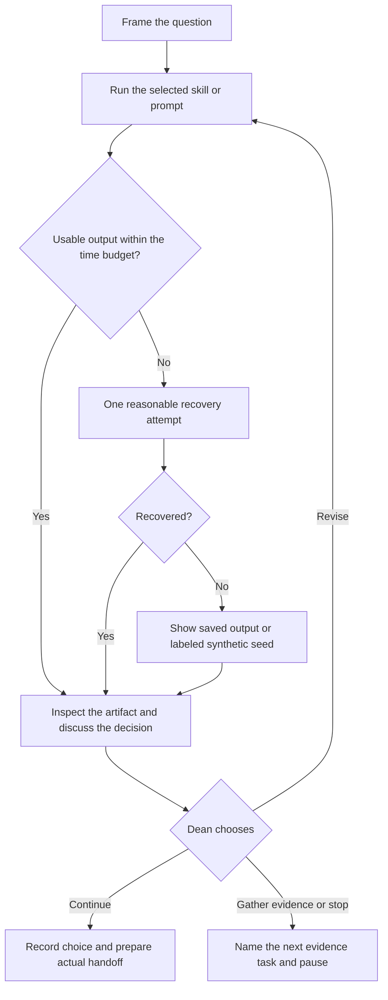

# Monday demo: Build the Right Thing Before Building It Right

Presenter: Dean Peters. Monday, October 5, 2026.
Audience: Product Managers, founders and product teams.
Outcome: see editable conversations improve a discovery decision before committing to a build.

This is a presenter script, not a transcript or rehearsal receipt. All supplied manufacturing material is SYNTHETIC. Assistant responses vary. Gate replies are proposed lines for Dean to choose after inspecting actual output; they are not advance approvals. Your corrected ten-motion sequence governs this script.

## Before people arrive

Open this script, the [launchpad](../DEMO.md), your assistant and prepared fallbacks. Rehearse the actual tool path once, retaining prompts, inputs, outputs, decisions, handoffs, timing and screenshots under a dated `rehearsal/` folder (ignored by Git). Pre-run source-heavy market collection if using actual research; retain URLs, dates and limitations.

The [SHOWRUN](../SHOWRUN.md) plans approximately 60 minutes of active content within a 90-minute performance. Give Persona about 8 minutes and each other motion about 4; reserve framing, synthesis and recovery time. These are planning estimates, not recorded timings.

Each skill bundles a template and worked/weak examples. Open Persona's assets before the show so you can demonstrate the package as well as the conversation. Current fallback seeds link to synthetic worked examples; they are not successful rehearsal receipts.

## How to send each message

**Skill path:** use each `Read skills/...` message in an assistant with workspace file access. Open its template and examples when needed. Cloning does not install skills; an installed tool may use its supported skill invocation instead.

**Prompt path:** open the linked prompt and copy its entire large four-backtick block into your AI chat, then append the stage message without its `Read skills/...` line. The prompt includes the template and examples; no repo access is needed.

Replace `[PASTE ...]` with the actual small handoff, never the placeholder. At a tool change, carry the selected artifact content needed by the receiver, not the entire prior conversation or just a title. Preserve source labels and unknowns. Ask the prior motion to repair a missing handoff rather than inventing it.

This is manual interaction through your chosen assistant. No custom API integration is required, but a hosted chat still uses provider cloud inference and its allowance. Do not run the optional Claude eval harness on stage.

## Opening (5 minutes)

**Say:**

> AI made building faster. It did not make knowing what to build easier. Our starting request is “Build an AI predictive-maintenance dashboard.” Tonight we'll make the judgment visible before the build.
>
> This manufacturing situation is fictional. No customers were interviewed and no plant observations were collected. These aren't customers. They're hypothesis-generating machines.

Ask the room: “What would you need to know before funding that dashboard?” Take two answers as audience suggestions, not customer evidence. Use a prepared Hall of Shame slide only after checking its claims and sources before the show, then leave the deck.

## The rhythm on stage



Showing a fallback does not approve it. Identify its status, read it and make the next choice explicitly.

## 01. Market Intel

[Skill](../skills/dlab-step01-market-intel/SKILL.md) · [Template](../skills/dlab-step01-market-intel/template.md) · [Worked example](../skills/dlab-step01-market-intel/examples/worked-example.md) · [Prompt](../prompts/01-market-intel.md) · [Fallback illustration](../fallbacks/01-market-intel.md)

**Say:** “Start with the landscape. We are not selecting a segment or inventing a market-size number yet.”

**Send:**

```text
Read skills/dlab-step01-market-intel/SKILL.md and follow it.
Mode: Best guess. SYNTHETIC teaching exercise.
Domain: manufacturing maintenance decisions. Geography and time horizon are UNKNOWN.
Desired outcome: clearer decisions about which conflicting equipment concern to investigate next.
Initial ask: build an AI predictive-maintenance dashboard.
No actual interviews, plant observations or market sources are supplied. Market size, frequency, cost and willingness to pay are UNKNOWN.
No browsing or external actions for this walkthrough. Map plausible incumbents, substitutes, workarounds and candidate segment dimensions. Disclose source gaps; do not select a segment for me.
Produce the Market Intelligence Brief and stop at the human gate.
```

**Inspect:** Source limits, substitutes and candidate segment dimensions. A market sweep is not a selected segment.

**If the actual output supports this teaching choice, send:**

```text
Approve this provisional landscape for segment comparison only. Preserve the source register, candidate segment dimensions, alternatives and UNKNOWN quantities. Prepare the actual handoff for Segment. Record my choice, then stop.
```

**Transition:** “Next: Segment. What decision does that help us make?”

## 02. Segment

[Skill](../skills/dlab-step02-segment/SKILL.md) · [Template](../skills/dlab-step02-segment/template.md) · [Worked example](../skills/dlab-step02-segment/examples/worked-example.md) · [Prompt](../prompts/02-segment.md) · [Fallback illustration](../fallbacks/02-segment.md)

**Say:** “Market interest is broad. A segment is a deliberate boundary. We choose it; the assistant does not quietly choose for us.”

**Send:**

```text
Read skills/dlab-step02-segment/SKILL.md and follow it.
Mode: Best guess. Use the actual Market Intel handoff below.
Compare a few plausible manufacturing segments on relevant need, stakes, participant access, current alternatives and buying constraints. Qualitative comparisons need a stated basis; unknown evidence stays UNKNOWN.
Recommend a provisional discovery focus with inclusions and exclusions, not a researched persona or validated market.
Produce the Segment Selection Brief and stop for my segment choice.
[PASTE THE STEP 1 HANDOFF]
```

**Inspect:** Selected context and explicit inclusions/exclusions. Choosing a segment is not proof of attractiveness.

**If the actual output supports this teaching choice, send:**

```text
Select mid-sized manufacturing plants where maintenance managers make investigation decisions as the provisional teaching focus. This is not verified market attractiveness. Record the segment boundaries, tradeoff and evidence gaps, and prepare the actual handoff for Persona. Stop.
```

**Transition:** “Next: Persona. What decision does that help us make?”

## 03. Persona

[Skill](../skills/dlab-step03-persona/SKILL.md) · [Template](../skills/dlab-step03-persona/template.md) · [Worked example](../skills/dlab-step03-persona/examples/worked-example.md) · [Prompt](../prompts/03-persona.md) · [Fallback illustration](../fallbacks/03-persona.md)

**Say:** “Persona. A person in a situation, doing a job, with stakes and a workaround. Watch this reuse what we supplied and ask only what is missing.”

**Send:**

```text
Read skills/dlab-step03-persona/SKILL.md and follow it.
Mode: Guided. SYNTHETIC teaching exercise.
Use the actual selected segment below. Focal persona: maintenance manager.
Situation and trigger: equipment reports conflict before a next-investigation decision.
Functional job and desired outcome: make a clearer next-investigation choice.
No actual customer interviews or plant observations exist. Workaround, stakes, role relationships and evidence that could overturn the persona still need attention.
Reuse the actor, segment, trigger and job. Ask the first missing question only and wait. Build a situational Persona with jobs, pains, gains and constraints, not a decorative biography or an actor map.
[PASTE THE STEP 2 HANDOFF]
```

### The Guided exchange

Send each reply only after the matching question. If earlier context already answers it, skip it. Do not send the entire script as answers in advance.

| If the assistant asks | Reply |
|---|---|
| Q3, missing workaround portion | “Fictional workaround: review logs and talk with a technician. We have not observed this behavior.” |
| Q4, missing stakes or constraints | “Keep it safe.” |
| Q4 follow-up, what safe means | “No equipment control or real plant records. Actual operational stakes and role relationships remain UNKNOWN.” |
| Q5, what could overturn the persona | “We do not know whether report conflicts really change choices, or whether permission and coordination matter more.” |

Match the actual question rather than forcing these replies out of order. Guided capture allows at most five numbered questions and two labeled clarifications. If it repeats supplied context, send:

```text
The role, segment, trigger and functional job/outcome are already supplied. Reuse them. Ask only the missing portion, preserving the question numbers. Missing measurements stay UNKNOWN.
```

**Say:** “Good. ‘Keep it safe’ was vague. Clarify it, then move on. The persona is a useful hypothesis, not a customer we just interviewed.”

**Inspect:** Actual persona, jobs/pains/gains, workaround and risky assumption. No invented quotes or decorative demographics.

**If the actual output supports this teaching choice, send:**

```text
Retain this maintenance-manager situational persona for the teaching path. Jobs, pains, gains and workarounds remain assumptions until researched. Approve only tree exploration. Carry the actual persona and its evidence gaps into the handoff for Opportunity Solution Tree. Record my choice, then stop.
```

**Transition:** “Next: Opportunity Solution Tree. What decision does that help us make?”

## 04. Opportunity Solution Tree

[Skill](../skills/dlab-step04-opportunity-solution-tree/SKILL.md) · [Template](../skills/dlab-step04-opportunity-solution-tree/template.md) · [Worked example](../skills/dlab-step04-opportunity-solution-tree/examples/worked-example.md) · [Prompt](../prompts/04-opportunity-solution-tree.md) · [Fallback illustration](../fallbacks/04-opportunity-solution-tree.md)

**Say:** “Opportunities belong in the tree. Needs first, then solution candidates, then experiments. A dashboard is a solution candidate, not a customer need.”

**Send:**

```text
Read skills/dlab-step04-opportunity-solution-tree/SKILL.md and follow it.
Mode: Best guess. Use the actual situational persona below.
Keep the outcome explicit. Build a compact Outcome → Opportunities → Solutions → Experiments tree.
Compare needs around source/recency uncertainty with the competing permission/coordination explanation. Both remain hypotheses unless actual evidence is supplied.
Offer a few solution candidates, including a process alternative, and attach a cheap disconfirming experiment. Do not put feature names in opportunity boxes or choose a concept for me.
Produce the Opportunity Solution Tree and stop at the human gate.
[PASTE THE STEP 3 HANDOFF WITH THE ACTUAL PERSONA]
```

**Inspect:** One needs-based opportunity, its solution candidates and disconfirming experiment. Approving the tree does not choose a branch.

**Ask the room:** “Which opportunity survives if the dashboard disappears?” If the report-comparison branch was not produced, ask to add and compare it before choosing. If another branch deserves the investment, select it and change downstream inputs accordingly.

**If the actual output supports this teaching choice, send:**

```text
Select the provisional report-comparison process that makes source, timing and uncertainty visible, with the person making the investigation decision. Approve comparison in the 2x2 only; not validation or a build commitment. Carry the actual selected opportunity/concept, coordination alternative and candidate experiment into the handoff. Record my choice, then stop.
```

**Transition:** “Next: Value Prop vs. Differentiation 2x2. What decision does that help us make?”

## 05. Value Prop vs. Differentiation 2x2

[Skill](../skills/dlab-step05-value-prop-differentiation/SKILL.md) · [Template](../skills/dlab-step05-value-prop-differentiation/template.md) · [Worked example](../skills/dlab-step05-value-prop-differentiation/examples/worked-example.md) · [Prompt](../prompts/05-value-prop-differentiation.md) · [Fallback illustration](../fallbacks/05-value-prop-differentiation.md)

**Say:** “Does the proposed value matter? Is the difference meaningful against the real alternative? Those are separate questions.”

**Send:**

```text
Read skills/dlab-step05-value-prop-differentiation/SKILL.md and follow it.
Mode: Best guess. Use the human-selected opportunity and concept below.
Compare proposed customer value on the horizontal axis with meaningful differentiation from a named alternative on the vertical axis. Define low/high for this context and include all four quadrants.
Current comparator for the teaching path: technician discussion and log review; actual practice is unobserved.
AI novelty is not evidence of either axis. Missing evidence is UNKNOWN, not low; any placement remains provisional or conditional. No moat, measured benefit or validated demand claims.
Produce the Value Prop vs. Differentiation 2x2 and stop at the human gate.
[PASTE THE STEP 4 HANDOFF WITH SELECTED OPPORTUNITY AND CONCEPT]
```

**Inspect:** Two separately supported axes and a named comparator. No missing evidence promoted into a winning quadrant.

**Ask the room:** “Can something be different without being valuable? Valuable without being different?” Point to the corresponding quadrants.

**If the actual output supports this teaching choice, send:**

```text
Retain the selected concept for a provisional positioning statement. Value and differentiation remain untested; any matrix placement is conditional. Carry the actual separate assessments, comparator and proof gaps into the handoff. Record my choice, then stop.
```

**Transition:** “Next: Positioning Statement. What decision does that help us make?”

## 06. Positioning Statement

[Skill](../skills/dlab-step06-positioning-statement/SKILL.md) · [Template](../skills/dlab-step06-positioning-statement/template.md) · [Worked example](../skills/dlab-step06-positioning-statement/examples/worked-example.md) · [Prompt](../prompts/06-positioning-statement.md) · [Fallback illustration](../fallbacks/06-positioning-statement.md)

**Say:** “Can we explain why this is for this person, and why they would choose it over today's workaround?”

**Send:**

```text
Read skills/dlab-step06-positioning-statement/SKILL.md and follow it.
Mode: Best guess. Use the actual persona, selected concept and 2x2 comparison below.
Draft a clear positioning statement with target, need, category, benefit, alternative and proposed difference. Use provisional language where evidence is missing.
Distinguish a proposed meaningful difference from a supported reason to believe. Do not invent superiority, exclusivity or downtime savings.
Produce the Positioning Statement and stop for my wording choice.
[PASTE THE STEP 5 HANDOFF WITH THE ACTUAL COMPARISON]
```

**Inspect:** Target, need, category, benefit, alternative, difference and UNKNOWN proof. Read the statement aloud.

**If the actual output supports this teaching choice, send:**

```text
Select the proposed statement only if it preserves our target, concept, real alternative and uncertainty. Approve it for hypothesis drafting, not as proven positioning. Carry the actual statement and its clause-level evidence gaps into the handoff. Record my choice, then stop.
```

**Transition:** “Next: Solution Hypothesis. What decision does that help us make?”

## 07. Solution Hypothesis

[Skill](../skills/dlab-step07-solution-hypothesis/SKILL.md) · [Template](../skills/dlab-step07-solution-hypothesis/template.md) · [Worked example](../skills/dlab-step07-solution-hypothesis/examples/worked-example.md) · [Prompt](../prompts/07-solution-hypothesis.md) · [Fallback illustration](../fallbacks/07-solution-hypothesis.md)

**Say:** “Now we make the proposition falsifiable. What would make us revise it or stop?”

**Send:**

```text
Read skills/dlab-step07-solution-hypothesis/SKILL.md and follow it.
Mode: Best guess. Use the actual chosen positioning statement below.
Write If we / for / then / because for the selected concept and persona. Mark the mechanism as a hypothesis.
Pick the riskiest assumption, one or two tiny acts of discovery, and expected versus disconfirming observations. Write the task, protocol and revise/stop/another-test rule before any experiment.
Proposed teaching question: does explicit source/recency context help a person explain the next investigation, or does permission/coordination dominate?
Participant access has not been arranged. No results exist. Mark NOT RUN.
Produce the Solution Hypothesis and stop for my hypothesis/protocol choice.
[PASTE THE STEP 6 HANDOFF WITH THE ACTUAL POSITIONING STATEMENT]
```

**Inspect:** Observable causal hypothesis, tiny acts, disconfirmation and a rule written before results.

**If the actual output supports this teaching choice, send:**

```text
Select the hypothesis about source/recency context helping a person explain the next investigation. Retain the proposed task, expected/disconfirming observations and rule, including the competing coordination explanation. Approve story exploration only. Carry the actual hypothesis and protocol into Storyboard; experiment NOT RUN. Record my choice, then stop.
```

**Transition:** “Next: Storyboard. What decision does that help us make?”

## 08. Storyboard

[Skill](../skills/dlab-step08-storyboard/SKILL.md) · [Template](../skills/dlab-step08-storyboard/template.md) · [Worked example](../skills/dlab-step08-storyboard/examples/worked-example.md) · [Prompt](../prompts/08-storyboard.md) · [Fallback illustration](../fallbacks/08-storyboard.md)

**Say:** “We have a hypothesis. Let's show the person acting, receiving a response and acting again. We have not written the MVN yet.”

**Send:**

```text
Read skills/dlab-step08-storyboard/SKILL.md and follow it.
Mode: Best guess. Use the actual selected hypothesis and protocol below.
No Minimum Viable Narrative exists yet. Create a six-frame descriptive storyboard directly from the hypothesis: context, trigger, action, response, new action, consequence.
Show the person, motivation, information exchanged and uncertainty. Keep the person making the investigation decision. The consequence is fictional, not measured plant benefit.
Include a reaction question and portable renderer prompt if useful. No rendering now; mark NOT RENDERED.
Produce the Storyboard and stop at the human gate.
[PASTE THE STEP 7 HANDOFF WITH THE ACTUAL HYPOTHESIS AND RULE]
```

**Inspect:** Six descriptive frames with context → trigger → action → response → new action → consequence. NOT RENDERED unless an actual renderer ran.

**If the actual output supports this teaching choice, send:**

```text
Approve these fictional storyboard frames for MVN drafting only. Carry all actual six frames, hypothesis, task and rule in the handoff; no rendering or participant experiment is implied. Record my choice, then stop.
```

**Transition:** “Next: Minimum Viable Narrative. What decision does that help us make?”

## 09. Minimum Viable Narrative

[Skill](../skills/dlab-step09-minimum-viable-narrative/SKILL.md) · [Template](../skills/dlab-step09-minimum-viable-narrative/template.md) · [Worked example](../skills/dlab-step09-minimum-viable-narrative/examples/worked-example.md) · [Prompt](../prompts/09-minimum-viable-narrative.md) · [Fallback illustration](../fallbacks/09-minimum-viable-narrative.md)

**Say:** “Tighten the storyboard into the smallest story worth testing. Keep the action-response-new-action loop.”

**Send:**

```text
Read skills/dlab-step09-minimum-viable-narrative/SKILL.md and follow it.
Mode: Best guess. Use the actual approved six storyboard frames below.
Write the minimum viable narrative: Setup, Encounter, Action, Response, New Action, Resolution. Preserve actor agency, hypothesis, uncertainty and the prewritten experiment rule.
Remove ornamental features. This is descriptive context, not a UI specification, PRD or architecture.
Provide a self-contained descriptive prototype prompt carrying the actual narrative, task and constraints. No build.
Produce the Minimum Viable Narrative and stop at the human gate.
[PASTE THE STEP 8 HANDOFF WITH ALL ACTUAL SIX FRAMES]
```

**Inspect:** The actual approved storyboard tightened into the six-part MVN. No unselected features or architecture.

**If the actual output supports this teaching choice, send:**

```text
Approve this narrative for comparing experiment fidelities. Carry the full actual six-part narrative, hypothesis, task, boundaries and prewritten rule into Prototyping. No build is authorized by narrative approval. Record my choice, then stop.
```

**Transition:** “Next: Prototyping. What decision does that help us make?”

## 10. Prototyping

[Skill](../skills/dlab-step10-prototyping/SKILL.md) · [Template](../skills/dlab-step10-prototyping/template.md) · [Worked example](../skills/dlab-step10-prototyping/examples/worked-example.md) · [Prompt](../prompts/10-prototyping.md) · [Fallback illustration](../fallbacks/10-prototyping.md)

**Say:** “The prototype has to earn its cost. If paper answers the question, paper wins.”

**Send:**

```text
Read skills/dlab-step10-prototyping/SKILL.md and follow it.
Mode: Best guess. Use the actual narrative and hypothesis below.
Learning question: can the person explain a next investigation, what makes it uncertain and what additional information they need?
Compare interview, paper comparison, storyboard and interaction. Recommend the cheapest method that can answer the question; do not force a build.
Retain the agreed experiment rule or propose a revision explicitly. Use fictional data only. No real records, plant commands, integrations, publishing or other external actions.
No participant experiment or build has run. Mark NOT BUILT and NOT RUN.
Produce the Prototype Experiment Brief and stop at the human fidelity/build gate.
[PASTE THE STEP 9 HANDOFF WITH THE FULL NARRATIVE AND EXPERIMENT RULE]
```

**Inspect:** Cheaper alternatives, fidelity rationale, actual protocol and separate build/experiment statuses. No added eleventh learning stage.

**If the actual output supports this teaching choice, send:**

```text
Choose the cheaper paper/storyboard comparison for the first test, if it answers the question. Approve the protocol, not an outcome. Keep build NOT BUILT and participant experiment NOT RUN. Record the next evidence task: recruit relevant practitioners, examine a recent real decision and test the report-uncertainty versus coordination explanations. Access is not arranged. Prepare the final handoff and stop the chain.
```

## Optional rendering and build branches

The main script produces a storyboard and experiment brief, not a rendered image or built interface. If rendering has been rehearsed, show the actual saved result or use the generated renderer prompt in your chosen tool after selecting that action. Keep SYNTHETIC visible. Inspect actor continuity and unsupported claims. No renderer is bundled here.

If interaction earns its cost and you explicitly choose a local teaching build, use the actual builder prompt and experiment brief:

```text
Build the smallest local throwaway HTML/CSS/JS version of the approved interaction above.
Use fictional reports and visible SYNTHETIC labels. No network requests, analytics, credentials, integrations, real plant records, equipment commands or deployment.
Preserve the selected hypothesis, full narrative and task; let the person explain their choice.
Save a new version under prototype/ without overwriting meaningful work. Report the actual files and checks. Do not invent participant observations or claim production readiness. Stop after the build.
```

A builder with file access is required. If it stalls, show a saved prototype or the brief and continue. A functioning interface is implementation evidence, not validated product value.

If an actual participant exercise occurs, record exactly what happened and compare observations with the prewritten rule inside Prototyping. Audience reactions are not plant evidence. With no exercise, keep NOT RUN. There is no eleventh stage.

## Close (5 minutes)

Show Persona's skill, template, worked/weak examples and prompt equivalent side by side.

**Say:**

> A prompt lets you try the play in a normal chat. A skill makes the bounded play repeatable. An agent could operate across these plays, preserving the actual handoffs and stopping for our decisions. A plugin could distribute the kit.
>
> Today I operated the chain. We haven't implemented an autonomous discovery operator. We also haven't proved customer demand by completing ten artifacts.
>
> Learn faster. Decide better. Then build.

Invite people to start with one motion and their own context. The repo remains private until the attendee release; check access before promising a QR code works for everyone.

## Recovery without debugging on stage

For actual saved rehearsal outputs: “AI demos obey Murphy's Law, so I brought receipts.”

For today's seeds: “This is a synthetic illustration of the motion. It is not customer evidence.”

Give a tool one reasonable recovery, then show the artifact. Do not infer approval from a timeout.

| Problem | Repair |
|---|---|
| Skill can't be read | Paste the linked prompt's full block and the invocation without the `Read skills/...` line. |
| Persona becomes an actor map | “Develop the focal situational persona, including jobs/pains/gains, workaround, trigger and stakes. Keep related roles secondary.” |
| Opportunities become features | “Rewrite opportunity branches as needs or obstacles; put implementations under solutions.” |
| 2x2 declares an AI moat | “Separate value from difference against the actual comparator; unsupported placement stays conditional or UNKNOWN.” |
| Storyboard demands an MVN first | “Use the selected Solution Hypothesis to create frames. MVN follows the actual storyboard.” |
| Missing artifact at a tool change | Ask the previous motion to carry the actual selected artifact and rule, not merely its title. |
| Synthetic content becomes truth | “Relabel the fictional material and remove unsupported validation or benefit claims.” |
| Automatic build | “Stop at the brief, compare cheaper methods and wait for my fidelity/build choice.” |
| Gate silently crossed | “Return to the last recorded human decision; mark later choices unapproved and wait.” |

If time is tight, show saved Market Intel and Segment, keep Persona live, then demonstrate tree selection and the 2x2. Use actual saved hypothesis/storyboard/MVN handoffs to reach Prototyping. Announce saved and skipped motions; a shortened show is not a full live chain.

## Rehearse once before Monday

Run this actual interaction path in the chosen tools, capture final outputs and decisions after fixes, and time the transitions. Confirm a new chat can consume each required handoff. The script and historical model results do not replace rehearsal.

The local check makes no model calls:

```bash
./scripts/test-library.sh
```
