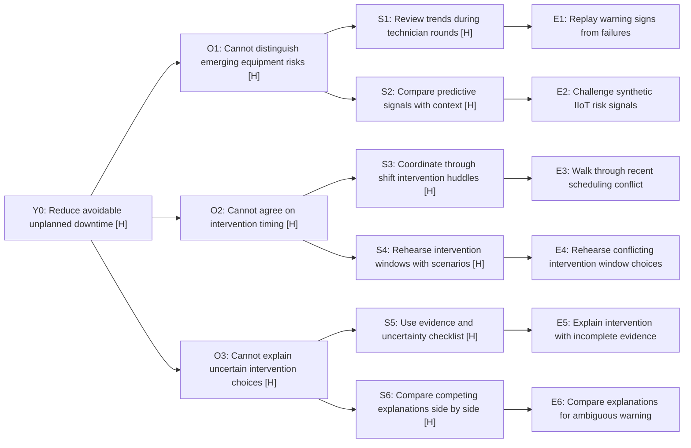

# Opportunity Solution Tree: from dashboard request to predictive intervention

SYNTHETIC teaching fixture F1, authored October 4, 2026. No interviews, observed plant records, validated predictions or commercial results. Status DRAFT; decider not recorded. Lab adaptation, not authoritative Productside artwork.

## Request, persona and outcome

**Incoming request:** “Build an AI-enhanced maintenance dashboard.”
**Persona:** maintenance manager in a mid-sized manufacturing plant, coordinating maintenance with production and technicians.
**Underlying outcome:** reduce avoidable unplanned downtime through timely, justified intervention. The desired shift is intervention by prediction instead of intervention by exception; a dashboard is one candidate means, not the outcome.
**Metric:** unplanned downtime hours per operating period; baseline, target and horizon UNKNOWN. Better decisions are a proposed mechanism, not proof of fewer failures or increased margins.

## Branching tree

Legend: H = ESTIMATE / BEST GUESS from fictional fixture F1. All problem/solution nodes and outcome feasibility are hypotheses. All E nodes are proposed tests, NOT RUN. Short node labels are backed by the register and test cards below.



Equivalent plain-text tree for a chat or workshop canvas:

```text
Y0: Reduce avoidable unplanned downtime [H]
+-- O1: Cannot distinguish emerging equipment risks [H]
  +-- S1: Review trends during technician rounds [H]
    +-- E1: Replay warning signs from failures
  +-- S2: Compare predictive signals with context [H]
    +-- E2: Challenge synthetic IIoT risk signals
+-- O2: Cannot agree on intervention timing [H]
  +-- S3: Coordinate through shift intervention huddles [H]
    +-- E3: Walk through recent scheduling conflict
  +-- S4: Rehearse intervention windows with scenarios [H]
    +-- E4: Rehearse conflicting intervention window choices
+-- O3: Cannot explain uncertain intervention choices [H]
  +-- S5: Use evidence and uncertainty checklist [H]
    +-- E5: Explain intervention with incomplete evidence
  +-- S6: Compare competing explanations side by side [H]
    +-- E6: Compare explanations for ambiguous warning
```

## Node and evidence register

All entries use basis F1 (authored fictional scenario), date October 4, 2026; label ESTIMATE / BEST GUESS. There are no source URLs because no external research was performed. Actual customer prevalence, cause, benefit, feasibility, economics and authority relationships are UNKNOWN. E nodes are proposed tests, not test results.

| ID | Primary parent | Description / specific limitation |
|---|---|---|
| Y0 | none | Reduce avoidable unplanned downtime; untested hypothesis |
| O1 | Y0 | Cannot distinguish emerging equipment risks; untested hypothesis |
| O2 | Y0 | Cannot agree on intervention timing; untested hypothesis |
| O3 | Y0 | Cannot explain uncertain intervention choices; untested hypothesis |
| S1 | O1 | Review trends during technician rounds; untested hypothesis |
| S2 | O1 | Compare predictive signals with context; untested hypothesis |
| S3 | O2 | Coordinate through shift intervention huddles; untested hypothesis |
| S4 | O2 | Rehearse intervention windows with scenarios; untested hypothesis |
| S5 | O3 | Use evidence and uncertainty checklist; untested hypothesis |
| S6 | O3 | Compare competing explanations side by side; untested hypothesis |
| E1 | S1 | Replay warning signs from failures; result NOT RUN |
| E2 | S2 | Challenge synthetic IIoT risk signals; result NOT RUN |
| E3 | S3 | Walk through recent scheduling conflict; result NOT RUN |
| E4 | S4 | Rehearse conflicting intervention window choices; result NOT RUN |
| E5 | S5 | Explain intervention with incomplete evidence; result NOT RUN |
| E6 | S6 | Compare explanations for ambiguous warning; result NOT RUN |

## Assumption tests

| Test | Solution | Riskiest assumption | Smallest test / observable signal | Disconfirmation / next decision |
|---|---|---|---|---|
| E1 | S1 | Past warning signs were available early enough | Review a recent real failure with a practitioner; identify the signal and decision timeline | Signals appear only after failure → revise early-warning premise |
| E2 | S2 | An understandable signal changes intervention reasoning | Simulate equipment failures using synthetic IIoT data; vary false warnings and missing inputs, then ask a practitioner to explain an intervention choice | Same choice without signal, confusion or excessive false warnings → revise mechanism; synthetic replay alone cannot validate real prediction accuracy |
| E3 | S3 | Authority/coordination is the bottleneck | Walk through a recent scheduling conflict; identify who could authorize action and when | Authority was already clear → deprioritize this explanation |
| E4 | S4 | Window rehearsal changes feasible timing choices | Scenario walkthrough of two intervention windows; observe choices and production constraints | Neither window was feasible regardless of information → examine capacity constraints |
| E5 | S5 | Explicit gaps enable a defensible next action | Give incomplete evidence and a checklist; observe rationale and unresolved uncertainty | Uncertainty is understood but action remains blocked → revisit authority/timing |
| E6 | S6 | Comparing explanations changes investigation choice | Contrast plausible causes of an ambiguous warning; observe whether the next check changes | Explanations add no useful distinction → revise comparison approach |

Proposed test appetite: short practitioner conversations and scenario walkthroughs before coding; timing/cost and recruitment access UNKNOWN. All experiments NOT RUN. Criteria are planning hypotheses, not validated thresholds. No live machine commands, integrations, publishing or build authorized.

## Customer-payoff bridge

All links remain F1 hypotheses; no customer budget or economics validated.

| Branch | Delight / changed work | Customer outcome → economic lever | Realization condition / proof needed |
|---|---|---|---|
| O1 | Stop warning-reconciliation scramble; act on explainable signals | Earlier feasible intervention → less recoverable lost capacity/contribution | Signal must change action early enough; demand/capacity and false-warning costs matter |
| O2 | Stop chasing permission and unworkable timing | Coordinated feasible intervention → fewer avoidable outages or overtime | Confirm actual authority/timing barrier; a huddle may beat software |
| O3 | Stop searching repeatedly to defend a choice | Better explanation → useful investigation capacity or less rework | Clarity must change decisions; time released is not automatic cash saving |

Proposed payer/budget: plant leader's maintenance improvement investment, UNKNOWN authority/WTP. Protected contribution does not itself release an expense budget. For S2, fees, integration, false warnings and human review may overwhelm payoff; provider inference/support/onboarding may overwhelm price. S3/S5 could deliver the outcome without a recurring software purchase. Pricing is not selected here; the 2x2 can test the budget and cost case alongside rival alternatives.

## Branch comparison and recommendation

| Branch | Expected outcome contribution | Evidence strength | Test cost/access / feasibility | Tradeoff |
|---|---|---|---|---|
| O1 | Earlier recognition may enable earlier action | F1 hypotheses only | Recent failure access unknown; synthetic replay cheap but weak external validity | Better signals may not overcome blocked action |
| O2 | Action might occur sooner with authority and timing clear | F1 competing explanation | Practitioner access unknown; conversation/huddle rehearsal before software | Coordination may already work adequately |
| O3 | Clearer reasoning may improve intervention choice | F1 hypothesis only | Fictional task cheap; real workflow fit unknown | Comprehension does not prove operational benefit |

**Recommended portfolio:** retain S1–S6 for the 2x2; focus initial comparison on S2 predictive signal context, S3 intervention huddles and S5 evidence checklist. They contrast signal quality, coordination and decision reasoning rather than variations of one dashboard.
**Optional first test:** E3 recent scheduling conflict, paired with E1 failure timeline. These could cheaply reveal whether missing information or inability to act dominates; practitioner access must be arranged.
**Counterargument:** existing warning signals may already be adequate and production capacity may prevent any timely intervention. If that appears in actual cases, revise toward O2 or another supported opportunity instead of protecting S2.
**Human choice:** not recorded; no POC winner or automatic next motion.

## Optional context for the 2x2

Target/outcome above; carry all six candidate IDs/descriptions with their parent opportunity IDs, test IDs and F1 evidence limits. Treat the dashboard request as input to explore, not authorization or proof that its predictive version should win. Competitor offerings/status quo can join the next comparison without needing this tree as a formal prerequisite.

## Final readout

For a maintenance manager, the goal is less avoidable unplanned downtime, not a dashboard shipped. Compare S2 predictive signal context (O1), S3 intervention huddles (O2) and S5 evidence checklist (O3), keeping S1/S4/S6 available. These branches test different explanations: inadequate warning, blocked coordination and uncertain reasoning. Customer payoff would be less warning-reconciliation and fewer recoverable lost productive hours, protecting contribution after intervention/adoption costs. Proposed budget owner is the plant leader; authority, WTP and provider delivery economics UNKNOWN. A process alternative may be better and cheaper. Investigate a recent scheduling conflict, failure timeline and buyer requirements before increasing fidelity. Everything here is a SYNTHETIC hypothesis; baseline, access and operational benefit are UNKNOWN. Synthetic IIoT can expose scenario weaknesses but cannot prove real prediction accuracy, downtime savings or margin improvement. Decide which branch/test to pursue, revise or stop; human selection and decider are not recorded.
