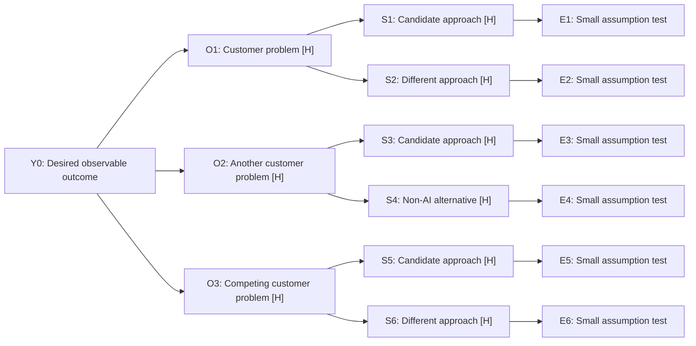

# Opportunity Solution Tree

Lab adaptation informed by Dean's Product Manager libraries. Use context already supplied; no upstream artifact is mandatory.

- Date / built from:
- Status: DRAFT
- Decider: not recorded
- Synthetic status:

## Request, persona and outcome

- Incoming request (preserve wording):
- Persona / situation:
- Desired outcome and why it matters:
- Observable metric / baseline / target / horizon: [supported values or UNKNOWN]

## Branching tree

Fill the nodes with actual short labels. H means ESTIMATE / BEST GUESS; U means UNKNOWN. Add a sourced-data label when warranted and keep actual URLs/dates in the register. Default to three opportunities and two or three distinct solutions each; fewer is appropriate when justified. Add sub-opportunities only when useful. Retain supplied branches or explain any proposed removal.



Provide the equivalent filled plain-text tree; do not leave template labels in a delivered artifact.

```text
Y0: Desired observable outcome
+-- O1: Customer problem [H]
  +-- S1: Candidate approach [H]
    +-- E1: Small assumption test
  +-- S2: Different approach [H]
    +-- E2: Small assumption test
+-- O2: Another customer problem [H]
  +-- S3: Candidate approach [H]
    +-- E3: Small assumption test
  +-- S4: Non-AI alternative [H]
    +-- E4: Small assumption test
+-- O3: Competing customer problem [H]
  +-- S5: Candidate approach [H]
    +-- E5: Small assumption test
  +-- S6: Different approach [H]
    +-- E6: Small assumption test
```

## Node and evidence register

| ID | Primary parent | Description | Evidence label / source or basis / date | Limitation or conflict |
|---|---|---|---|---|
| Y0 | none | | | |
| O1 | Y0 | | | |
| S1 | O1 | | | |
| E1 | S1 | | | |

Add all actual nodes. Cross-links must be explicit, not duplicate candidates with new IDs.

## Assumption tests

| Test ID | Solution IDs | Riskiest assumption | Smallest test | Observable signal | Disconfirmation / decision rule |
|---|---|---|---|---|---|
| E1 | S1 | | | | |

Cover every serious candidate; label missing test knowledge UNKNOWN and name the research task. Show proposed timeframe/cost/access and NOT RUN status. Simulation generates hypotheses, not customer or plant validation.

## Customer-payoff bridge

| Branch | Friction removed / newly possible action | Customer outcome → economic lever | Realization condition / evidence needed |
|---|---|---|---|
| O1 | | | |

For serious options note proposed payer/budget source, adoption burden and delivery-cost risks. These are hypotheses where unsupported, not invented pricing or a mandatory purchase decision.

## Branch comparison and recommendation

| Opportunity | Why it could move the outcome | Evidence strength | Test cost/access and feasibility | Tradeoff / uncertainty |
|---|---|---|---|---|
| O1 | | | | |

- Recommended focus / candidate portfolio (IDs and descriptions):
- Why this over the alternatives:
- Optional first discriminating test:
- Strongest counterargument / evidence that would change focus:
- Selected option / decider: not recorded

## Optional context for the 2x2

[Carry actual candidate IDs/descriptions, parent opportunities, test ideas and evidence limits. No required winner, named input file or automatic transition.]

## Final readout

[Fill with target/outcome, recommended focus/portfolio and rationale, customer payoff/economic lever, biggest gap and next decision. About 100–150 words of prose. Reference IDs; do not duplicate the tree. Preserve DRAFT and whether selection is actually recorded.]
